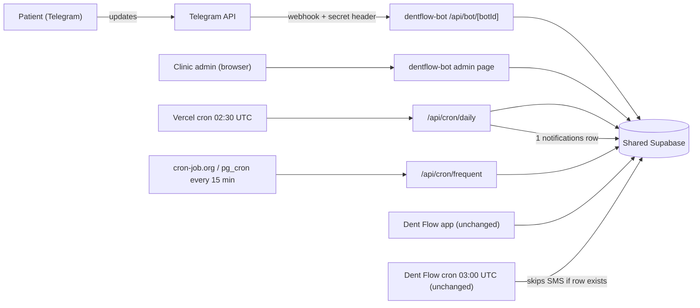

# DentFlow Patient Telegram Bot: Implementation Plan

## Goal

Build a **standalone patient self-service Telegram bot service** for DentFlow. It must not change a single file in the `Dent Flow` repo. The bot shares the existing Supabase database:

- **Reads:** clinics, staff, patients, services, appointments, treatments, payments, tooth_status
- **Writes:** `patients` and `appointments` rows, plus one `notifications` row per reminder
- **Owns:** its state in new `bot_*` tables

**What gets created:**
- **New code project:** `/home/baxramov21/antigravity-projects/dentflow-bot`, with its own git repo
- **New Vercel project:** for deploying the bot
- **Supabase:** the **same** project as DentFlow, with additive `bot_*` tables only

## Decisions (from the interview)

| # | Topic | Decision |
|---|-------|----------|
| 1 | Audience | Patients (self-service) |
| 2 | Tenancy | **New bot per clinic** (2nd BotFather token; never the existing one) |
| 3 | DB boundary | Repo untouched; **additive** `bot_*` tables and RPCs in Supabase are OK |
| 4 | Clinic onboarding | Standalone admin page; login with existing DentFlow credentials; `staff.role='admin'` |
| 5 | Identity | Share contact → match by last 9 phone digits → else self-register as a new `patients` row |
| 6 | Booking | Instant booking into free 30-min slots; `status='scheduled'`; notes prefixed `[Telegram]` |
| 7 | Manage | Cancel/reschedule own future `scheduled`/`confirmed` appointments until N h before (default 2h) |
| 8 | Reminders | Booking confirmation + 07:30 "tomorrow" reminder (Confirm/Cancel), logged once in `notifications` → existing cron skips SMS. Optional 2h reminder |
| 9 | Staff alerts | Bot posts events to a staff group bound with `/bind <code>` |
| 10 | Languages | Uzbek (Latin) + Russian |
| 11 | Features | Clinic info, price list, visit history, feedback, balance/debt, dental chart |
| 12 | Stack | Next.js 16 + grammY on Vercel; Supabase-backed sessions; external 15-min trigger |
| 13 | Location | `/home/baxramov21/antigravity-projects/dentflow-bot` (own git repo) |
| 14 | Shared phones | Family profiles: link all matches; "Who is this for?" picker; add family member |
| 15 | Toggles | Per-clinic feature toggles; debt and chart **OFF by default** |

---

## User Review Required

> [!IMPORTANT]
> **Why a new token per clinic is mandatory.** Telegram allows only one webhook per bot. Each clinic's existing token in `clinics.telegram_bot_token` already points at DentFlow's `/api/webhook/telegram`. Also, the DentFlow Settings page re-registers that webhook every time the clinic saves its settings. The admin page will **reject** a token equal to `clinics.telegram_bot_token`.

> [!IMPORTANT]
> **Coupling with the existing reminder cron (intentional).** [reminders/route.js](file:///home/baxramov21/antigravity-projects/Dent%20Flow/src/app/api/cron/reminders/route.js#L56-L63) skips an appointment if a `sent`/`delivered` notification already exists, and it checks with `.single()`. Our 07:30 job (02:30 UTC, before DentFlow's 03:00 UTC cron) inserts **exactly one** row:
> - `type='telegram'`, `template='bot_reminder_24h'`
>
> If two or more rows exist, `.single()` errors and DentFlow would send an SMS anyway. So booking confirmations and 2h reminders are logged **only** in `bot_message_log`, never in `notifications`. If our send fails, we insert nothing, and DentFlow's SMS fallback still runs.

> [!WARNING]
> **Race conditions.** DentFlow's dashboard inserts appointments with no overlap check. The bot books through a Postgres function that takes an advisory lock per dentist and re-checks overlap. That prevents bot-vs-bot double booking. A bot-vs-receptionist collision within the same second remains theoretically possible.

## Open Questions

> [!IMPORTANT]
> **Should the bot also write `patients.telegram_chat_id`?**
> - **If yes:** the dashboard patient page shows "Telegram Ulangan" for bot-linked patients, which helps staff.
> - **The catch:** this is an existing column. DentFlow's cron would then try the *old* clinic bot for that patient. That only happens if our reminder wasn't logged, and the attempt would fail before falling back to SMS.
> - **My default:** **don't write it**. Links live only in `bot_patient_links`. Tell me if you want the badge.

> [!NOTE]
> **Issues I noticed in DentFlow (not fixing, since the repo is untouchable):**
> - [reports/route.js:95](file:///home/baxramov21/antigravity-projects/Dent%20Flow/src/app/api/cron/reports/route.js#L95) calls `sendTelegramMessage(chatId, msg)` without a bot token, so daily reports never send.
> - [settings/telegram/route.js](file:///home/baxramov21/antigravity-projects/Dent%20Flow/src/app/api/settings/telegram/route.js) has no auth check: any caller can overwrite any clinic's token.

---

## Architecture

**Supabase access rules**
- The bot runs server-side with `SUPABASE_SERVICE_ROLE_KEY`, which bypasses RLS. So **every query is explicitly scoped by `clinic_id` and by linked `patient_id`s** in code.
- `bot_*` tables have RLS enabled with **no policies**, so only the service role can touch them.

---

## Phase Overview

All new files live in `/home/baxramov21/antigravity-projects/dentflow-bot`. Nothing is created or modified under `Dent Flow/`.

```mermaid
flowchart LR
  P0["0. Prerequisites"] --> P1["1. Foundation"]
  P1 --> P2["2. Admin page"]
  P2 --> P3["3. Patient onboarding"]
  P3 --> P4["4. Read-only features"]
  P4 --> P5["5. Booking + staff alerts"]
  P5 --> P6["6. Reminders + feedback"]
  P6 --> P7["7. Balance, chart, stats"]
  P7 --> P8["8. Deploy + rollout"]
```

| Phase | Outcome | Est. effort |
|---|---|---|
| 0 | Accounts, test bot and env values ready | ~30 min (you) |
| 1 | Project skeleton; a test bot answers through the webhook | 0.5–1 day |
| 2 | Clinic admin can connect a bot from the browser | 1 day |
| 3 | Patients can identify themselves or register; family profiles | 1 day |
| 4 | Clinic info, prices, my appointments, history | 0.5–1 day |
| 5 | Real booking, cancel and reschedule, staff group alerts | 1.5–2 days |
| 6 | 24h and 2h reminders, Confirm/Cancel buttons, feedback | 1 day |
| 7 | Balance, dental chart (toggle-gated), admin stats | 0.5 day |
| 8 | Production deploy; pilot clinic live | 0.5 day |

Every phase ends in a working, testable state, so we can stop after any phase and still have something usable.

---

## Phase 0: Prerequisites (done by you)

**Goal:** have everything needed to start coding.

- [ ] Create a **test bot** in @BotFather (e.g. `DentFlowTestBot`) and keep its token. This must **not** be a clinic's existing token.
- [ ] Copy from the Supabase dashboard: Project URL, `anon` key, `service_role` key. These are the same values as DentFlow's `.env.local`.
- [ ] Pick a **test clinic** in the DB with at least 1 dentist, a few services and some patients.
- [ ] (For Phase 8) A Vercel account, and a free cron-job.org account (or enable `pg_cron` + `pg_net` in Supabase).

---

## Phase 1: Foundation

**Goal:** an empty but working bot project. The test bot replies through both long-polling (local) and the webhook route.

### Files
| File | Purpose |
|---|---|
| `package.json`, `next.config.mjs`, `jsconfig.json`, `.gitignore`, `.env.example`, `README.md`, `AGENTS.md` | Scaffold: `next@16`, `react@19`, `grammy`, `@supabase/supabase-js`, `@supabase/ssr`, `date-fns`, `@date-fns/tz`; dev `vitest`, `eslint-config-next` |
| `supabase/migrations/001_bot_core.sql` | Tables `bot_clinics`, `bot_users`, `bot_patient_links`, `bot_sessions`; RLS on with no policies; function `bot_find_patients_by_phone(clinic, last9)` |
| `src/lib/supabaseAdmin.js` | Service-role client (server only) |
| `src/lib/crypto.js` | AES-256-GCM encrypt/decrypt of bot tokens (`BOT_TOKEN_ENC_KEY`) |
| `src/lib/phone.js` | `normalizeLast9()`, `formatUz()` → `+998-XX-XXX-XX-XX` (the dashboard's format) |
| `src/lib/time.js` | Clinic-timezone helpers (`clinics.timezone`, default `Asia/Tashkent`) |
| `src/bot/createBot.js` | Bot factory: session → i18n → context loader (`ctx.clinic`, `ctx.cfg`) → handlers |
| `src/bot/session.js` | grammY `StorageAdapter` on `bot_sessions` |
| `src/bot/i18n/{index,uz,ru}.js` | `t(key, vars)` with uz/ru dictionaries |
| `src/app/api/bot/[botId]/route.js` | Webhook: load `bot_clinics`, verify `X-Telegram-Bot-Api-Secret-Token`, `webhookCallback(bot,'std/http')` |
| `scripts/poll.js` | `npm run bot:poll -- <botClinicId>`: local long-polling, with no tunnel needed |
| `tests/phone.test.js`, `tests/crypto.test.js` | Unit tests |

Before coding I'll read `node_modules/next/dist/docs/` (your AGENTS.md rule) for Next 16 route handler, server action and proxy/middleware conventions.

### Done when
- [ ] You run `001_bot_core.sql` in the Supabase SQL editor; DentFlow keeps working (nothing existing was altered).
- [ ] A manually inserted `bot_clinics` row with the test token answers `/ping` via `bot:poll`.
- [ ] `vitest`, `npm run lint` and `npm run build` pass.

---

## Phase 2: Admin Page (clinic onboarding)

**Goal:** a clinic admin logs in with their DentFlow credentials and connects their new bot without your help.

### Files
| File | Purpose |
|---|---|
| `src/lib/supabaseServer.js` | `@supabase/ssr` cookie client |
| `src/lib/telegramAdmin.js` | `getMe`, `setWebhook` (with `secret_token`), `deleteWebhook`, `setMyCommands`, `setMyDescription` |
| `src/proxy.js` (or middleware, per Next 16 docs) | Protect admin routes |
| `src/app/globals.css` | Design system: premium dark UI, vanilla CSS |
| `src/app/(admin)/login/page.js` | Email/password login (same Supabase Auth as DentFlow) |
| `src/app/(admin)/clinic/page.js` | Clinic picker (if admin of several), connection card, toggles, staff-group card |
| `src/app/(admin)/actions.js` | Server actions: `connectBot`, `disconnectBot`, `saveSettings`, `generateBindCode` |

### Behavior
- **Access:** only users with a `staff` row where `role='admin'`.
- **`connectBot`:**
  1. Validate the token with `getMe`.
  2. **Reject** it if it equals `clinics.telegram_bot_token`.
  3. Encrypt and upsert `bot_clinics`.
  4. Call `setWebhook` to `${APP_URL}/api/bot/<id>`.
  5. Call `setMyCommands` (uz/ru).
- **Show:** `@username`, deep link `t.me/<bot>?start`, and a downloadable **QR code** (`qrcode` package).
- **Toggles UI:** self-registration, cancel plus cutoff hours, 2h reminder, feedback, balance (off), dental chart (off), slot length, booking horizon.

### Done when
- [ ] Login works with an existing DentFlow admin account; non-admins are denied.
- [ ] DentFlow's existing token is rejected; the test token connects, and `getWebhookInfo` shows our URL.
- [ ] The QR code opens the bot. Disconnect removes the webhook.

---

## Phase 3: Patient Onboarding

**Goal:** a patient opens the bot, picks a language, shares their phone, and is linked to existing records or registered.

### Files
| File | Purpose |
|---|---|
| `src/bot/handlers/onboarding.js` | `/start` → language → `request_contact` → match or register |
| `src/bot/handlers/family.js` | "Who is this for?" picker; "➕ Add family member" |
| `src/bot/handlers/menu.js` | Main reply keyboard (buttons appear as later phases add features) |
| `src/bot/handlers/settings.js` | Change language; re-share phone |

### Behavior
- **Contact check:** accept a contact only if `contact.user_id === ctx.from.id`. This rejects forwarded contacts.
- **Matching:** `bot_find_patients_by_phone` within **this clinic only**. All matches are linked in `bot_patient_links`.
- **No match + `allow_self_register`:** ask full name, DOB (skippable) and gender. Insert into `patients` with the phone formatted as the dashboard does and `notes='[Telegram] …'`.
- **No match + registration off:** show the clinic phone.

### Done when
- [ ] A known phone, in any stored format, links correctly; shared phones show the family picker.
- [ ] A new phone self-registers, and the patient **appears in DentFlow's Patients list**.
- [ ] A forwarded contact is rejected; uz/ru switching works.

---

## Phase 4: Read-Only Features

**Goal:** useful information with no writes, which makes it safe to pilot early.

### Files
| File | Purpose |
|---|---|
| `src/bot/handlers/info.js` | 🏥 Clinic info (name, address, phone, working hours); 🦷 Services by category with prices (`name_uz`/`name_ru` → `name`) |
| `src/bot/handlers/appointments.js` | 🗓 Upcoming appointments for all linked patients (listing only, for now) |
| `src/bot/handlers/history.js` | 📖 Past `completed` appointments + completed `treatment_items` (service, tooth); paginated |

### Done when
- [ ] Data shown in the bot matches the DentFlow dashboard for the test clinic.
- [ ] No data from other clinics or unlinked patients is ever visible (manual scoping check).

---

## Phase 5: Booking Engine and Staff Alerts

**Goal:** patients book, cancel and reschedule for real; staff see it in the DentFlow calendar and in their Telegram group.

### Files
| File | Purpose |
|---|---|
| `supabase/migrations/002_bot_booking.sql` | Function `bot_book_appointment(...)`: advisory lock per dentist, overlap re-check, insert, raise `SLOT_TAKEN` |
| `src/lib/slots.js` | Pure slot engine |
| `tests/slots.test.js` | Unit tests |
| `src/bot/handlers/booking.js` | Patient → dentist/"Any" → date → slot → confirm |
| `src/bot/handlers/appointments.js` | (extend) Cancel / reschedule buttons |
| `src/bot/handlers/staffGroup.js` | `/bind <code>`, `/unbind` (groups only) |
| `src/bot/notifyStaff.js` | 🆕 / ♻️ / ❌ messages to `staff_chat_id` |
| `src/app/(admin)/…` | (extend) Bind-code generator and bound status |

### Slot rules
- **Open hours:** the day's window from `clinics.working_hours[mon..sun]` (`null` = closed), in the clinic's timezone.
- **Grid and lead time:** step = `slot_minutes` (30); keep only slots after now + `min_lead_minutes` and within `booking_horizon_days`.
- **Busy:** a slot is busy if it overlaps an appointment of that dentist with status **not** `cancelled`/`no_show`. That includes `arrived`, `in_chair` and `billing`.
- **"Any" dentist:** the union of free slots; on confirm, assign the free dentist with the fewest appointments that day.

### Booking and change rules
- **Insert:** `status='scheduled'`, notes `[Telegram] …`. No treatment plan is created (DentFlow's [CheckoutView.js](file:///home/baxramov21/antigravity-projects/Dent%20Flow/src/components/CheckoutView.js#L229-L268) creates one on demand).
- **Cancel:** only `scheduled`/`confirmed` appointments more than `cancel_cutoff_hours` away → `status='cancelled'` + note.
- **Reschedule:** book the new slot first, then cancel the old one.

### Done when
- [ ] `slots.test.js` passes (closed days, timezone, lead time, every busy status, "any" assignment).
- [ ] Two simultaneous RPC calls for the same slot → exactly one succeeds.
- [ ] A bot booking appears in **DentFlow's calendar** with `[Telegram]`; the staff group gets the alert.
- [ ] Cancel inside the cutoff is blocked; reschedule never leaves the patient without an appointment.

---

## Phase 6: Reminders and Feedback

**Goal:** automatic reminders that work with DentFlow's existing cron instead of duplicating it.

### Files
| File | Purpose |
|---|---|
| `supabase/migrations/003_bot_messaging.sql` | Tables `bot_message_log` (unique `appointment_id, kind`) and `bot_feedback` |
| `src/app/api/cron/daily/route.js` | 02:30 UTC 24h reminders (details below) |
| `src/app/api/cron/frequent/route.js` | Every 15 min: 2h reminders + feedback requests |
| `src/bot/handlers/reminderActions.js` | ✅ Confirm → `status='confirmed'` (if still `scheduled`); ❌ Cancel (same rules as Phase 5) |
| `src/bot/handlers/feedback.js` | 1–5 ⭐ + optional comment → `bot_feedback`; a rating of 2 or lower alerts the staff group |
| `src/bot/handlers/booking.js` | (extend) Booking confirmation logged as `booking_confirm` in `bot_message_log` |
| `scripts/cron.js` | Trigger jobs locally |
| `vercel.json` | Cron `30 2 * * *` → `/api/cron/daily` |

### Daily job (`/api/cron/daily`)
- **Window:** the same UTC "tomorrow" window DentFlow's cron uses, so the dedupe lines up.
- **Who:** linked patients with `scheduled`/`confirmed` appointments, at clinics whose bot is active.
- **On success:** insert **one** `notifications` row (`type='telegram'`, `template='bot_reminder_24h'`) and a `bot_message_log` row.
- **On failure:** insert nothing into `notifications` (DentFlow's SMS fallback still runs). On a 403, set `bot_users.is_blocked`.

### Frequent job (`/api/cron/frequent`)
- **2h reminder:** appointments starting in 105–135 min, if `reminder_2h_enabled`. Deduped only in `bot_message_log`.
- **Feedback request:** appointments that became `completed`, starting 1h after `end_time`, once each, if `feedback_enabled`.
- Both jobs are protected by `CRON_SECRET`.

### Done when
- [ ] The daily job sends the reminder and creates exactly one `notifications` row; DentFlow's `/api/cron/reminders` then **skips** that appointment (no SMS).
- [ ] Confirm shows as `confirmed` in DentFlow; the 2h reminder and the feedback request each fire exactly once.

---

## Phase 7: Sensitive Features and Admin Stats

**Goal:** opt-in financial and medical views, plus a simple dashboard for clinic admins.

### Files
| File | Purpose |
|---|---|
| `src/bot/handlers/balance.js` | 💳 Σ completed `treatment_items.price_override` − Σ `payments.amount` per linked patient (the dashboard's formula); only if `show_balance` |
| `src/bot/handlers/chart.js` | 🦷 Non-healthy `tooth_status` grouped by status with emoji legend; only if `show_dental_chart` |
| `src/app/(admin)/clinic/page.js` | (extend) Stats: linked patients, bot bookings (7/30 days), cancellations, average rating, recent low ratings |

### Done when
- [ ] Balance and chart are hidden by default and appear immediately after enabling the toggle.
- [ ] The balance equals the debt shown in DentFlow's appointment form for the same patient.

---

## Phase 8: Deploy and Rollout

**Goal:** production bot live for a pilot clinic.

- [ ] Create a new git repo for `dentflow-bot` and a new **Vercel project** linked to it.
- [ ] Set env vars: `NEXT_PUBLIC_SUPABASE_URL`, `NEXT_PUBLIC_SUPABASE_ANON_KEY`, `SUPABASE_SERVICE_ROLE_KEY`, `BOT_TOKEN_ENC_KEY`, `CRON_SECRET`, `NEXT_PUBLIC_APP_URL`.
- [ ] Configure cron-job.org (or `pg_cron`) to call `/api/cron/frequent` every 15 min with `Authorization: Bearer <CRON_SECRET>`.
- [ ] The pilot clinic admin creates the real bot in BotFather, connects it in the admin page, binds the staff group, and prints the QR code.
- [ ] Watch for one week: Vercel logs, `bot_message_log` failures, SMS counts dropping for bot-linked patients.
- [ ] Final "untouched" check: `git status` in `Dent Flow/` is clean; the existing clinic bots' `/start` + phone linking still works.

---

## Cross-Cutting Verification

- **Automated (every phase):** `vitest` (phone, crypto, slots, i18n key parity uz↔ru), `npm run lint`, `npm run build`.
- **Data isolation:** every query is reviewed for `clinic_id` plus linked-patient scoping before each phase is marked done.
- **Regression:** after each migration, open the DentFlow dashboard (calendar, patients, checkout) to confirm nothing changed.
